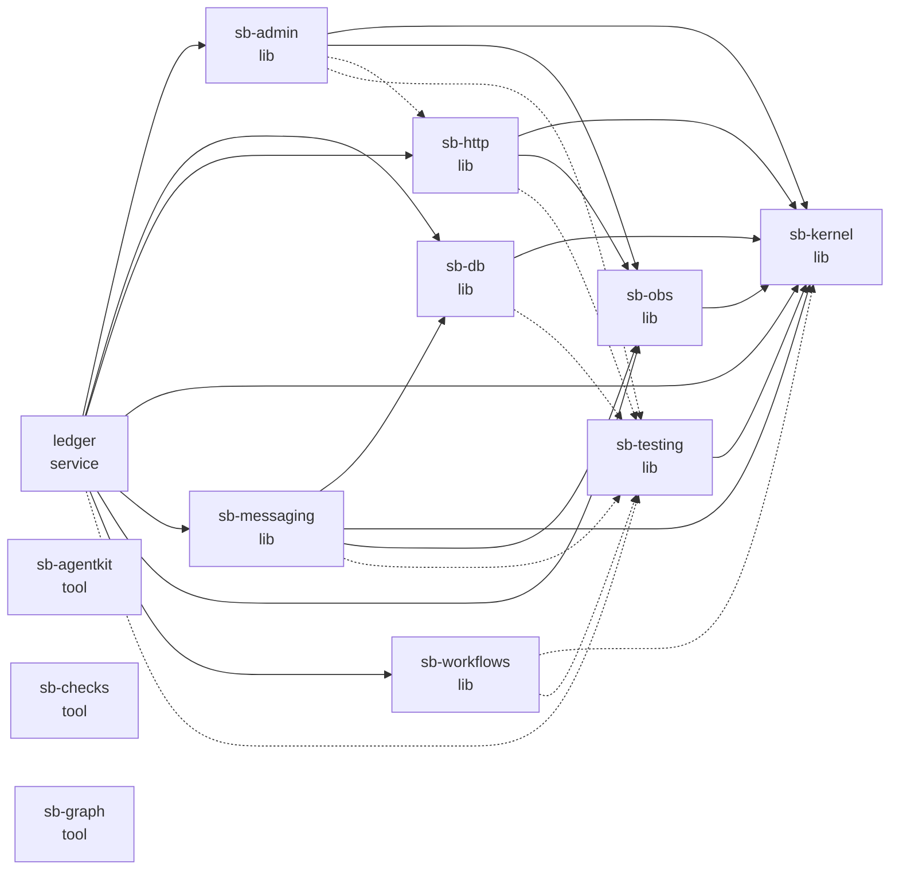

<!-- Generated by `make graph`. Do not edit. -->
# Build graph

```mermaid
flowchart LR
  ledger["ledger<br/>service"]
  sb_admin["sb-admin<br/>lib"]
  sb_agentkit["sb-agentkit<br/>tool"]
  sb_checks["sb-checks<br/>tool"]
  sb_db["sb-db<br/>lib"]
  sb_graph["sb-graph<br/>tool"]
  sb_http["sb-http<br/>lib"]
  sb_kernel["sb-kernel<br/>lib"]
  sb_messaging["sb-messaging<br/>lib"]
  sb_obs["sb-obs<br/>lib"]
  sb_testing["sb-testing<br/>lib"]
  sb_workflows["sb-workflows<br/>lib"]
  ledger --> sb_admin
  ledger --> sb_db
  ledger --> sb_http
  ledger --> sb_kernel
  ledger --> sb_messaging
  ledger --> sb_obs
  ledger --> sb_workflows
  sb_admin --> sb_kernel
  sb_admin --> sb_obs
  sb_db --> sb_kernel
  sb_http --> sb_kernel
  sb_http --> sb_obs
  sb_messaging --> sb_db
  sb_messaging --> sb_kernel
  sb_messaging --> sb_obs
  sb_obs --> sb_kernel
  sb_testing --> sb_kernel
  ledger -.-> sb_testing
  sb_admin -.-> sb_http
  sb_admin -.-> sb_testing
  sb_db -.-> sb_testing
  sb_http -.-> sb_testing
  sb_messaging -.-> sb_testing
  sb_workflows -.-> sb_kernel
  sb_workflows -.-> sb_testing
```
